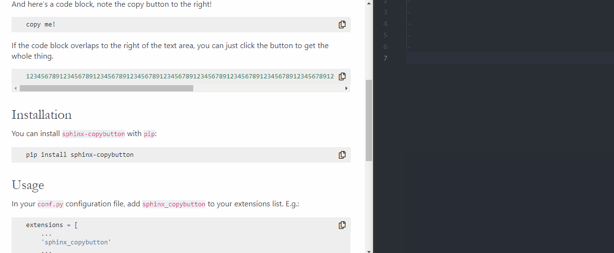

=================
Sphinx-copybutton
=================

.. image:: https://readthedocs.org/projects/sphinx-copybutton/badge/?version=latest
   :target: https://sphinx-copybutton.readthedocs.io/en/latest/?badge=latest
   :alt: Documentation

.. image:: https://img.shields.io/pypi/v/sphinx-copybutton.svg
   :target: https://pypi.org/project/sphinx_copybutton
   :alt: PyPi page

.. image:: https://img.shields.io/conda/vn/conda-forge/sphinx-copybutton.svg
   :target: https://anaconda.org/conda-forge/sphinx-copybutton
   :alt: Conda Version

Sphinx-copybutton does one thing: add a little "copy" button to the right
of your code blocks. That's it! It is a lightweight wrapper around the
excellent (and also lightweight) Javascript library
`ClipboardJS <https://clipboardjs.com/>`_.

**Here's an example**

And here's a code block, note the copy button to the right!

.. code-block:: bash

   copy me!

If the code block overlaps to the right of the text area, you can just click
the button to get the whole thing.

.. code-block:: bash

   123456789123456789123456789123456789123456789123456789123456789123456789123456789123456789123456789123456789123456789123456789123456789123456789123456789123456789

You can configure ``sphinx-copybutton`` to detect *input prompts* in code
cells, and then both remove these prompts before copying, as well as skip
lines that *don't* start with prompts (in case they are output lines).

For example, this site has been configured to strip Python prompts (">>> ").
Try copy-pasting the code block below.

.. code-block:: python

   >>> a = 2
   >>> print(a)
   2

   >>> b = 'wow'
   >>> print(b)
   wow

Installation
============

.. note::

   ``sphinx-copybutton`` only works on Python >= 3.4

You can install ``sphinx-copybutton`` with ``pip``:

.. code-block:: bash

   pip install sphinx-copybutton

Or with ``conda`` via ``conda-forge``:

.. code-block:: bash

   conda install -c conda-forge sphinx-copybutton

`Here's a link to the sphinx-copybutton GitHub repository <https://github.com/ExecutableBookProject/sphinx-copybutton>`_.

Usage
=====

In your ``conf.py`` configuration file, add ``sphinx_copybutton`` to your
extensions list. E.g.:

.. code-block:: python

   extensions = [
       ...
       'sphinx_copybutton'
       ...
   ]

When you build your site, your code blocks should now have little copy buttons
to their right. Clicking the button will copy the code inside!

Customization
=============

Sphinx-copybutton was designed to work with the default Sphinx theme,
`Alabaster <https://alabaster.readthedocs.io/en/latest/>`_. If you use a theme
that doesn't play nicely with sphinx-copybutton's CSS, you can always add
your own CSS rules!

Customize the CSS
-----------------

To customize the display of the copy button, you can add your own CSS files
that overwrite the CSS in the
`sphinx-copybutton CSS rules <https://github.com/ExecutableBookProject/sphinx-copybutton/blob/master/_static/copybutton.css>`_.
Just add these files to ``_static`` in your documentation folder, and it should
overwrite sphinx-copybutton's behavior.

.. _configure_copy_text:

Strip and configure input prompts for code cells
------------------------------------------------

By default, ``sphinx-copybutton`` will copy the entire contents of a code
block when the button is clicked. For many languages, it is common to
include **input prompts** with your examples, along with the outputs from
running the code.

``sphinx-copybutton`` provides functionality to both
strip input prompts, as well as *only* select lines that begin with a prompt.
This allows users to click the button and *only* copy the input text,
excluding the prompts and outputs.

To define the prompt text that you'd like removed from copied text in your code
blocks, use the following configuration value in your ``conf.py`` file:

.. code-block:: python

    copybutton_prompt_text = "myinputprompt"

When this variable is set, ``sphinx-copybutton`` will remove the prompt from
the beginning of any lines that start with the text you specify. In
addition, *only* the lines that contain prompts will be copied if any are
discovered. If no lines with prompts are found, then the full contents of
the cell will be copied.

For example, to exclude traditional Python prompts from your copied code,
use the following configuration:

.. code-block:: python

    copybutton_prompt_text = ">>> "

Using regexp prompt identifiers
~~~~~~~~~~~~~~~~~~~~~~~~~~~~~~~

If your prompts are more complex than a single string, then you can use a regexp to match with.

.. note::

   Keep in mind that the
   `RegExp <https://developer.mozilla.org/docs/Web/JavaScript/Reference/Global_Objects/RegExp>`_
   you are writing is
   `evaluated in JavaScript <https://github.com/executablebooks/sphinx-copybutton/blob/a58da090dae6f4d38870929e0258a0c8ee626f8f/sphinx_copybutton/_static/copybutton_funcs.js#L7>`_
   and not in Python.
   In some edge cases this might lead to different results.

If you enclose your regexp in a raw string (``r""``),
you can easily test that your RegExp matches all the wanted prompts,
i.e. at `RegEx101`_.

For example this documentation uses the following configuration:

.. code-block:: python

   copybutton_prompt_text = r">>> |\.\.\. |\$ |In \[\d*\]: | {2,5}\.\.\.: | {5,8}: "
   copybutton_prompt_is_regexp = True

Which matches the following prompts and their continuations if they exist:

.. list-table::
   :widths: 30 37 33
   :header-rows: 1

   * - Prompt Name
     - RegEx Pattern
     - Matched String Examples
   * - Python Repl + continuation
     - ``r'>>> |\.\.\. '``
     - ``'>>> '``, ``'... '``
   * - Bash
     - ``r'\$ '``
     - ``'$ '``
   * - ``ipython`` and ``qtconsole`` + continuation
     - ``r'In \[\d*\]: | {2,5}\.\.\.: '``
     - ``'In []: '``, ``'In [999]: '``, ``'  ...: '``, ``'     ...: '``
   * - ``jupyter-console`` + continuation
     - ``r'In \[\d*\]: | {5,8}: '``
     - ``'In []: '``, ``'In [999]: '``, ``'  ...: '``, ``'     ...: '``

An example usage would be the ``ipython``-directive:

.. code-block:: restructuredtext

   ``ipython`` and ``qtconsole`` style:

   .. code-block:: ipython

      In [1]: first
         ...: continuation
      output
      In [2]: second

   ``jupyter`` style:

   .. code-block:: ipython

      In [1]: first
            : continuation
      output
      In [2]: second

``ipython`` and ``qtconsole`` style:

.. code-block:: ipython

   In [1]: first
      ...: continuation
   output
   In [2]: second

``jupyter`` style:

.. code-block:: ipython

   In [1]: first
         : continuation
   output
   In [2]: second

If you want a detailed explanation how the RegEx's work you can also use `RegEx101`_ and read the ``Explanation`` sidebar.

.. _RegEx101: https://regex101.com

Configure whether *only* lines with prompts are copied
~~~~~~~~~~~~~~~~~~~~~~~~~~~~~~~~~~~~~~~~~~~~~~~~~~~~~~

By default, if sphinx-copybutton detects lines that begin with code prompts,
it will *only* copy the text in those lines (after stripping the prompts).
This assumes that the rest of the code block contains outputs that shouldn't
be copied.

To disable this behavior, use the following configuration in ``conf.py``:

.. code-block:: python

    copybutton_only_copy_prompt_lines = False

In this case, all lines of the code blocks will be copied after the prompts
are stripped.

Configure whether the input prompts should be stripped
~~~~~~~~~~~~~~~~~~~~~~~~~~~~~~~~~~~~~~~~~~~~~~~~~~~~~~

By default, sphinx-copybutton will remove the prompt text from lines
according to the value of ``copybutton_prompt_text``.

To disable this behavior and copy the full text of lines with prompts
(for example, if you'd like to copy *only* the lines with prompts, but not
strip the prompts), use the following configuration in ``conf.py``:

.. code-block:: python

    copybutton_remove_prompts = False

Use a different copy button image
~~~~~~~~~~~~~~~~~~~~~~~~~~~~~~~~~

To use a different image for your copy buttons, do the following:

1. Place the image in the ``_static/`` folder of your site.
2. Set the ``copybutton_image_path`` variable in your ``conf.py`` to be the
   path to your image file, **relative to** ``_static/``.

Configure the CSS selector used to add copy buttons
~~~~~~~~~~~~~~~~~~~~~~~~~~~~~~~~~~~~~~~~~~~~~~~~~~~

By default, ``sphinx-copybutton`` will add a copy button to all elements
that match the following selection:

.. code-block:: css

    div.highlight pre

To change this selector, use the following configuration in ``conf.py``:

.. code-block:: python

    copybutton_selector = "your.selector"

In this case, all elements that match ``your.selector`` will have a copy button
added to them.

Development
===========

If you'd like to develop or make contributions for sphinx-copybutton, fork
the repository here:

https://github.com/ExecutableBookProject/sphinx-copybutton

pull to your computer and install locally with ``pip``::

    pip install -e /path/to/sphinx_copybutton

**Pull requests** and **Issues** are absolutely welcome!

The package is tested for three things (see ``.github/workflows/integration.yml``):

code style
----------

To adhere to this code style install the package with `pre-commit <https://pre-commit.com/>`__:

.. code-block:: console

   $ pip install .[code_style]

Then you can run:

.. code-block:: console

   $ pre-commit run --all

Or setup pre-commit to run on code commits:

.. code-block:: console

   $ pre-commit install

JavaScript unit testing
-----------------------

Install the test dependencies with `npm <https://www.npmjs.com/>`__:

.. code-block:: console

   $ npm install ci

Then run the tests:

.. code-block:: console

   $ npm test

.. note::

   NodeJS >= 12 is required

Documentation builds
--------------------

Install the package:

.. code-block:: console

   $ pip install .

Then run the docs build:

.. code-block:: console

   $ cd doc
   $ make html

.. toctree::
   :maxdepth: 1

   second/second_page
